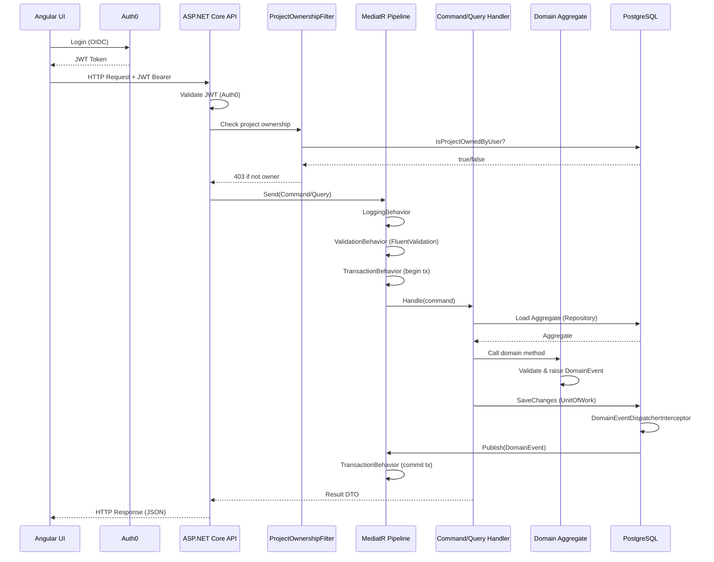
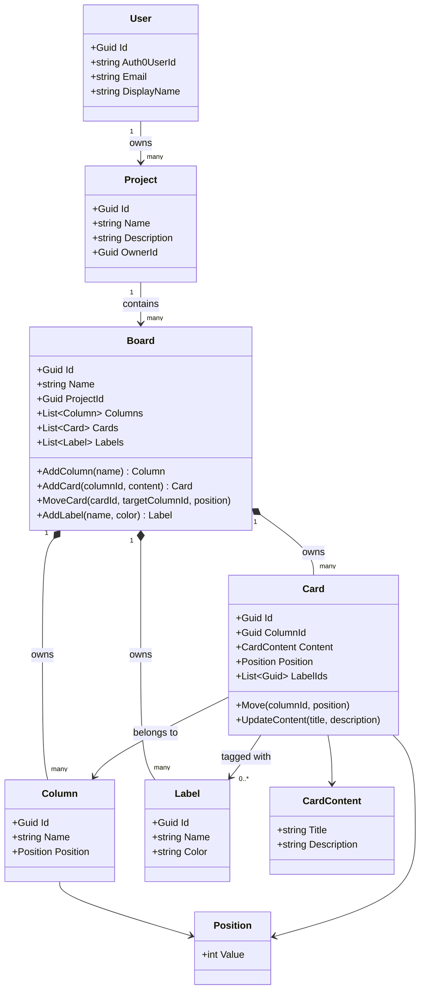

# NeonBoard Architecture Overview

## System Architecture

```mermaid
graph TB
    subgraph Client["Client Layer"]
        Browser["Browser"]
    end

    subgraph Angular["NeonBoard.UI (Angular 21)"]
        Auth0FE["Auth0 Angular SDK"]
        Router["Angular Router"]
        Guards["Guards\n(authGuard, unsavedChangesGuard)"]

        subgraph Features["Feature Modules"]
            Projects["Projects\n(list, create)"]
            ProjectDetail["Project Detail\n(layout, overview)"]
            BoardView["Board View\n(kanban canvas)"]
            BoardSettings["Board Settings"]
        end

        subgraph State["State Management (Signals)"]
            BoardFacade["BoardStateFacade"]
            SettingsFacade["BoardSettingsFacade"]
            SidebarFacade["SidebarStateFacade"]
            DrawerSvc["DrawerService"]
        end

        subgraph HttpSvcs["HTTP Services"]
            ProjectSvc["ProjectService"]
            BoardSvc["BoardService"]
            ColumnSvc["ColumnService"]
            CardSvc["CardService"]
            LabelSvc["LabelService"]
        end

        SharedUI["Shared Components\n(Button, Modal, Drawer, Badge, ...)"]
    end

    subgraph API["NeonBoard.Api (.NET 10 Minimal APIs)"]
        Auth0BE["Auth0 JWT Bearer"]
        GlobalExHandler["GlobalExceptionHandler"]
        CurrUserSvc["CurrentUserService"]
        OwnershipFilter["ProjectOwnershipFilter"]

        subgraph Endpoints["Endpoints"]
            ProjectEP["ProjectEndpoints\n/api/projects"]
            BoardEP["BoardEndpoints\n/api/projects/{id}/boards"]
            ColumnEP["ColumnEndpoints\n.../columns"]
            CardEP["CardEndpoints\n.../cards"]
            LabelEP["LabelEndpoints\n.../labels"]
        end
    end

    subgraph Application["NeonBoard.Application (CQRS)"]
        MediatR["MediatR"]

        subgraph Behaviors["Pipeline Behaviors"]
            LogBehavior["LoggingBehavior"]
            ValBehavior["ValidationBehavior"]
            TxBehavior["TransactionBehavior"]
        end

        subgraph Commands["Commands"]
            BoardCmds["Board Commands\n(Create, Update, Delete)"]
            ProjectCmds["Project Commands\n(Create, Update, Delete)"]
            ColumnCmds["Column Commands\n(Add, Rename, Delete, Reorder)"]
            CardCmds["Card Commands\n(Add, Update, Move, Delete)"]
            LabelCmds["Label Commands\n(Add, Update, Remove)"]
        end

        subgraph Queries["Queries"]
            BoardQueries["Board Queries\n(GetDetails, GetByProject)"]
            ProjectQueries["Project Queries\n(GetProject, GetByUser)"]
            CardQueries["Card Queries\n(GetCard)"]
        end

        FluentVal["FluentValidation\nValidators"]
        AppInterfaces["Interfaces\n(IRepository, IBoardRepository,\nIUnitOfWork, ICurrentUserService)"]
    end

    subgraph Domain["NeonBoard.Domain (DDD)"]
        subgraph Aggregates["Aggregates"]
            UserAgg["User\n(Auth0UserId, Email, DisplayName)"]
            ProjectAgg["Project\n(Name, Description, OwnerId)"]

            subgraph BoardAgg["Board Aggregate"]
                Board["Board\n(Name, ProjectId)"]
                Column["Column\n(Name, Position)"]
                Card["Card\n(Content, Position, LabelIds)"]
                Label["Label\n(Name, Color)"]
                Board -->|owns| Column
                Board -->|owns| Card
                Board -->|owns| Label
            end
        end

        subgraph DomainEvents["Domain Events"]
            BoardEvents["Board Events\n(Created, Deleted)"]
            ColumnEvents["Column Events\n(Added, Renamed, Deleted, Reordered)"]
            CardEvents["Card Events\n(Created, Updated, Moved, Deleted)"]
            LabelEvents["Label Events\n(Added, Updated, Removed)"]
        end

        subgraph ValueObjects["Value Objects"]
            Position["Position"]
            CardContent["CardContent\n(Title, Description)"]
        end

        DomainBase["Common Base\n(Entity, AggregateRoot, ValueObject,\nDomainException)"]
    end

    subgraph Infrastructure["NeonBoard.Infrastructure (EF Core + PostgreSQL)"]
        DbContext["ApplicationDbContext\n(IUnitOfWork)"]
        DomainEventInterceptor["DomainEventDispatcherInterceptor"]

        subgraph Repos["Repositories"]
            UserRepo["UserRepository"]
            ProjectRepo["ProjectRepository"]
            BoardRepo["BoardRepository"]
            GenericRepo["Repository&lt;T&gt;"]
        end

        subgraph EFConfig["EF Core Configuration"]
            UserConfig["UserConfiguration"]
            ProjectConfig["ProjectConfiguration"]
            BoardConfig["BoardConfiguration\n(owned entities, JSONB)"]
        end

        Migrations["EF Core Migrations"]
    end

    subgraph ExternalServices["External Services"]
        Auth0["Auth0\n(Identity Provider)"]
        PostgreSQL[("PostgreSQL 16\nneonboarddb")]
    end

    subgraph Orchestration["NeonBoard.AppHost (.NET Aspire)"]
        Aspire["Aspire Orchestration\n(local dev dashboard)"]
    end

    %% Client to Angular
    Browser <-->|HTTPS| Angular

    %% Angular internals
    Auth0FE <-->|OIDC/JWT| Auth0
    Router --> Guards
    Guards --> Features
    Features --> State
    State --> HttpSvcs

    %% Angular to API
    HttpSvcs <-->|REST + JWT Bearer| API

    %% API internals
    Auth0BE <-->|Validate JWT| Auth0
    Endpoints --> OwnershipFilter
    Endpoints --> CurrUserSvc
    Endpoints --> MediatR

    %% Application layer
    MediatR --> Behaviors
    Behaviors --> Commands
    Behaviors --> Queries
    Commands --> FluentVal
    Commands --> AppInterfaces
    Queries --> AppInterfaces

    %% Domain events
    Board -->|raises| DomainEvents

    %% Infrastructure implementations
    AppInterfaces -.->|implemented by| Repos
    Repos --> DbContext
    DbContext --> DomainEventInterceptor
    DomainEventInterceptor -->|MediatR.Publish| MediatR
    DbContext --> EFConfig
    DbContext <-->|SQL| PostgreSQL
    DbContext --> Migrations

    %% Aspire orchestration
    Aspire -->|hosts| API
    Aspire -->|hosts| Angular
    Aspire -->|provisions| PostgreSQL
```

## Request Flow

## Domain Model

## Tech Stack Summary

| Layer | Technology |
|---|---|
| Frontend Framework | Angular 21 (Standalone Components) |
| Frontend State | Angular Signals (Facade Pattern) |
| Frontend Styling | TailwindCSS 3 |
| Frontend Auth | @auth0/auth0-angular |
| Frontend Testing | Vitest + @analogjs/vitest-angular |
| Backend Framework | ASP.NET Core 10 Minimal APIs |
| Backend Pattern | Clean Architecture + DDD + CQRS |
| Backend Mediator | MediatR 12 |
| Backend Validation | FluentValidation 11 |
| Backend Auth | Auth0 JWT Bearer |
| ORM | Entity Framework Core 10 |
| Database | PostgreSQL 16 |
| Logging | Serilog + OpenTelemetry |
| Dev Orchestration | .NET Aspire 13 |
| Containerization | Docker (multi-stage build) |
| Identity Provider | Auth0 |
